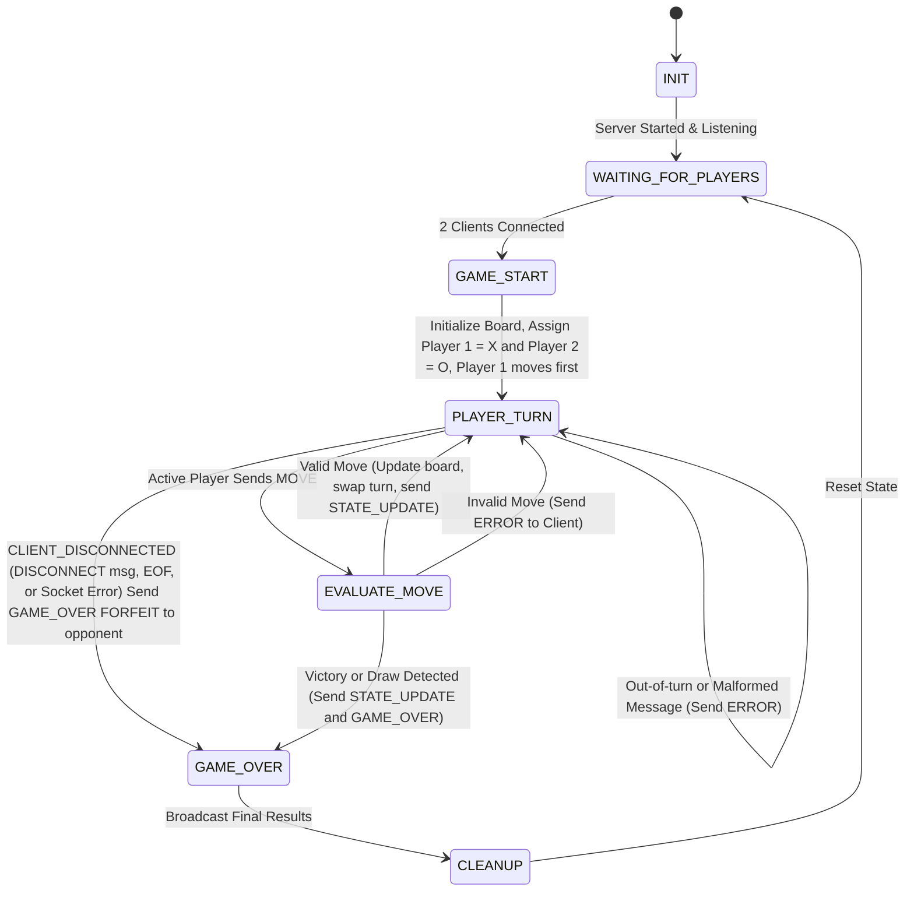

# CS 457 Project Statement of Work (SOW) & Protocol Specification Template

**Student Name:** Zaid Taiyab  
**Date:** 2026-09-19  
**Course:** CS 457 - Computer Networks  
**Target Server Domain:** `server.taiyab.edu`  

---

## 1. Game Selection & Scope (Sprint 0)

> Planning is going to be an iterative process through the sprints so you don't have to have all the details now. Focus on big overview concepts. You will be updating the SOW as we plan.
> You have a lot of freedom to choose a game. There are a couple caveats.  

> - It must run in the console. The lab nodes won't be able to handle extensive graphics.
> - It has to be self-contained. You can use a internet-connector to download you code, but because the architecture must run 5 nodes you won't be able to run 
> - You are encouraged to use python, but I'm not going to make it a strict requirement. The instructor and TA's ability to help with C or Rust, etc will be diminished in other languages.

### 1.1 Game Overview
- **Chosen Game:** Tic-Tac-Toe
- **Player Capacity:** 2 Players (Simulated via 2 CML Client nodes)
- **Game Summary:** 2 players take a turn to draw a X or O on a 3x3 board. The one who makes a straight line of their symbol wins. The straight line can be vertical, horizontal, or diagonal. The game can end in a draw if no straight line encompassing 3 places using matching symbol is formed but all places are filed.

### 1.2 Core Game Rules & Win/Draw Conditions
- **Turn Mechanics:** Player 1 makes the move and will be assigned the symbol X at default. After making the move, player 2 will make a move. The other player is not allowed to make a move until the previosu player has made a move and the game state is updated properly.
- **Victory Condition:** The first player to make a straight line with his symbol (encompassing 3 slots) wins. THe straight line should have the player's matching symbol filling 3 consecutive slots in a row and the line can be counter if its vertical, horizontal, or diagonal. 
- **Draw/Tie Condition:** The game can be ended in a draw if all the slots are filled but there is no victory condition satified i.e. no straight line encompassing 3 places using one player's matching symbol is formed.

---

## 2. Application-Layer Messaging Protocol Blueprint (Sprint 1 Deliverable)

### 2.1 Message Transport & Serialization Format
- **Transport Protocol:** TCP
- **Serialization Format:** Delimited Text 
- **Framing Mechanism:** Text Delimited Protocol

- **Framing Rule:** 
1) Message fields are separated by the '|' character
2) Newlines '(\n)' determine the end of the message. 
3) Subfields within messages use the ',' character. 
4) If message happens to be split across multiple recv() calls, I store the incomplete bytes and once \n is recieved then the message is considered complete.
5) If one recv() contains several messages, I split the buffer on \n. The complete messages are processed accordingly and the remaining bytes stay in buffer for future.

- **Wire Stream Example:** CONNECT|Player_1|1727000000\nMOVE|Player_1|0,2|1727000005\nSTATE_UPDATE|SERVER|-,-,X,-,-,-,-,-,-|Player_2|1727000006\n
 
- **Field Grammar Example:**  Format: CONNECT|<PLAYER_ID>|<TIMESTAMP>\n
                              Example: CONNECT|Player_1|1727000005\n
                              Fields:
                                - MSG_TYPE   (string)  : "CONNECT"
                                - PLAYER_ID  (string)  : Alphanumeric alias of connecting player (e.g. "Player_1")
                                - TIMESTAMP  (integer) : Unix epoch timestamp in seconds

                              Format: MOVE|<PLAYER_ID>|<ROW>,<COL>|<TIMESTAMP>\n
                              Example: MOVE|Player_1|0,2|1727000005\n
                              Fields:
                                - MSG_TYPE   (string)  : "MOVE"
                                - PLAYER_ID  (string)  : Alphanumeric alias of active player (e.g. "Player_1")
                                - PAYLOAD    (integers): <row>,<col> zero-indexed grid coordinates (e.g. "0,2")
                                - TIMESTAMP  (integer) : Unix epoch timestamp in seconds

- **TCP Stream Packet Framing & Boundary Handling:**

```python
# Handling Fragmentation
def fragmentation(buffer, data):
    return buffer + data

# Handling Coalescing
def coalescing(buffer):
    parts = buffer.split(b"\n")
    messages = parts[:-1]
    buffer = parts[-1]
    return messages, buffer

# Detecting TCP Infinite Loops + Handling Disconnects
buffer = b""
while True:
    try:
        data = sock.recv(1024)
        # Handle infinite loop
        if not data:
            logger.info("Remote peer disconnected (EOF received).")
            sock.close()
            trigger_state_transition("CLIENT_DISCONNECTED")
            break
        buffer = fragmentation(buffer, data)
        messages, buffer = coalescing(buffer)
        for msg in messages:
            handle_message(msg)
    except (ConnectionResetError, BrokenPipeError,
            ConnectionAbortedError, TimeoutError) as e:
        logger.warning(f"Connection lost abruptly: {e}")
        trigger_state_transition("CLIENT_DISCONNECTED")
        break
```
  
### 2.2 Message Schema Definitions

#### Message Types:
1. `CONNECT` (Client -> Server): Request to join the game room.
2. `LOBBY_WAIT` (Server -> Client): Notification that server is waiting for Player 2.
3. `GAME_START` (Server -> Clients): Game initiated, assigns roles (e.g. Player X vs Player O).
4. `MOVE` (Client -> Server): Player action (Current player selects a coordinate on grid to mark it).
5. `STATE_UPDATE` (Server -> Clients): Broadcast current game board / state and active player turn.
6. `GAME_OVER` (Server -> Clients): Victory / Draw notification with WIN/DRAW/FORFEIT.
7. `ERROR` (Server -> Client): Invalid move or malformed packet error.
8. `DISCONNECT` (Client -> Server): Player disconnects from the game. Results in forfeit win for opponent.

#### Example Text Delimited Protocol Schema:
```
  CONNECT|<PLAYER_ID>|<TIMESTAMP>\n
    Example: CONNECT|Player_1|1727000005\n
    Fields:
      - MSG_TYPE   (string)  : "CONNECT"
      - PLAYER_ID  (string)  : Alphanumeric alias of connecting player (e.g. "Player_1")
      - TIMESTAMP  (integer) : Unix epoch timestamp in seconds

  MOVE|<PLAYER_ID>|<ROW>,<COL>|<TIMESTAMP>\n
    Example: MOVE|Player_1|0,2|1727000005\n
    Fields:
      - MSG_TYPE   (string)  : "MOVE"
      - PLAYER_ID  (string)  : Alphanumeric alias of active player (e.g. "Player_1")
      - PAYLOAD    (integers): <row>,<col> zero-indexed grid coordinates (e.g. "0,2")
      - TIMESTAMP  (integer) : Unix epoch timestamp in seconds
    
  LOBBY_WAIT|SERVER|<STATUS>|<TIMESTAMP>\n
    Example: LOBBY_WAIT|SERVER|WAITING_FOR_PLAYER_2|1727000006\n
    Fields:
      - MSG_TYPE  (string)  : "LOBBY_WAIT"
      - SOURCE    (string)  : "SERVER"
      - STATUS    (string)  : Current lobby status (e.g. "WAITING_FOR_PLAYER_2")
      - TIMESTAMP (integer) : Unix epoch timestamp in seconds

  GAME_START|SERVER|<PLAYER_1>,<SYMBOL>|<PLAYER_2>,<SYMBOL>|<TIMESTAMP>\n
    Example: GAME_START|SERVER|Player_1,X|Player_2,O|1727000007\n
    Fields:
      - MSG_TYPE          (string)  : "GAME_START"
      - SOURCE            (string)  : "SERVER"
      - PLAYER_1,SYMBOL   (string)  : Player 1 identifier and assigned symbol
      - PLAYER_2,SYMBOL   (string)  : Player 2 identifier and assigned symbol
      - TIMESTAMP         (integer) : Unix epoch timestamp in seconds

  STATE_UPDATE|SERVER|<BOARD>|<ACTIVE_PLAYER>|<TIMESTAMP>\n
    Example: STATE_UPDATE|SERVER|X,-,-,-,O,-,-,-,-|Player_2|1727000011\n
    Fields:
      - MSG_TYPE       (string)  : "STATE_UPDATE"
      - SOURCE         (string)  : "SERVER"
      - BOARD          (string)  : Nine comma-separated cells representing the current board
      - ACTIVE_PLAYER  (string)  : Player whose turn is next
      - TIMESTAMP      (integer) : Unix epoch timestamp in seconds

  GAME_OVER|SERVER|<RESULT>|<PLAYER_ID>|<TIMESTAMP>\n
    Example: GAME_OVER|SERVER|WIN|Player_1|1727000015\n
    Fields:
      - MSG_TYPE   (string)  : "GAME_OVER"
      - SOURCE     (string)  : "SERVER"
      - RESULT     (string)  : Game result: "WIN", "DRAW", or "FORFEIT"
      - PLAYER_ID  (string)  : Winning player, or "-" if DRAW
      - TIMESTAMP  (integer) : Unix epoch timestamp in seconds

  ERROR|SERVER|<ERROR_CODE>|<TIMESTAMP>\n
    Example: ERROR|SERVER|OUT_OF_TURN|1727000012\n
    Fields:
      - MSG_TYPE    (string)  : "ERROR"
      - SOURCE      (string)  : "SERVER"
      - ERROR_CODE  (string)  : MALFORMED_MESSAGE | WRONG_STATE | OUT_OF_TURN | INVALID_COORDS | CELL_OCCUPIED
      - TIMESTAMP   (integer) : Unix epoch timestamp in seconds

  DISCONNECT|<PLAYER_ID>|<TIMESTAMP>\n
    Example: DISCONNECT|Player_1|1727000020\n
    Fields:
      - MSG_TYPE   (string)  : "DISCONNECT"
      - PLAYER_ID  (string)  : Alphanumeric alias of disconnected player
      - TIMESTAMP  (integer) : Unix epoch timestamp in seconds
```

### 2.3 Game State Machine (FSM) Design (Sprint 1 Deliverable)


- INIT: Initialization and server starts
- WAITING_FOR_PLAYERS: Waits until 2 players connect. 
- `GAME_START`: Initialize Board, Assign Player 1 = X and Player 2 = O, Player 1 moves first
- `PLAYER_TURN`: Waits for `MOVE` from the active player. Out-of-turn or malformed messages get `ERROR`.
- `EVALUATE_MOVE`: Validates the move, updates the board, checks for win or draw.
- `GAME_OVER`: Sends `GAME_OVER` (WIN, DRAW, or FORFEIT).
- `CLEANUP`: Closes sockets and reset state.

### Valid Moves
If invalid moves checks do not fail, then:
- Player's symbol (X or O) is placed in the cell.
- Checks for a win or draw.
- If there is no result, it swaps the active player, sends `STATE_UPDATE` to both clients, and stays in `PLAYER_TURN`.
- If there is a win or draw, it sends `STATE_UPDATE`, then `GAME_OVER`, and moves to `GAME_OVER`.

### Invalid Moves
1. The line has invalid syntax: `MALFORMED_MESSAGE`. Example: `MOVE|Player_1|abc`.
2. The server is not in `PLAYER_TURN`: `WRONG_STATE`. Example: a `MOVE` sent before `GAME_START`.
3. It is not the sender's turn: `OUT_OF_TURN`. Example: Player 2 moves on Player 1's turn.
4. The row or column is outside the grid: `INVALID_COORDS`. Example: `MOVE|Player_1|3,1|1727000008`.
5. The cell is already filled: `CELL_OCCUPIED`. Example: moving on a cell that holds `X`.

DISCONNECTIONS: Triggers CLIENT_DISCONNECTED


### 2.4 Connection Termination & Socket Lifecycle Management

1. Handling Disconnet Gracefully: the server receives `DISCONNECT|<PLAYER_ID>|<TIMESTAMP>\n`. Server sends `GAME_OVER|SERVER|FORFEIT|<surviving player>|<TIMESTAMP>\n` to opponent who wins by forfeit if game is in session.
2. Transport Layer Teardown (TCP FIN): `recv()` returns `b""`. Handled with trigger_state_transition("CLIENT_DISCONNECTED")
3. Abrupt Termination (TCP RST, network drop, timeout): `recv()` or `send()` raises an exception. Handled with trigger_state_transition("CLIENT_DISCONNECTED")
4. Socket Rule and Infinite Loop: when the peer closes cleanly, `recv()` does not raise an exception, it returns `b""`. Infinite Looping Handled with:

        ```python
        # Handle Socket Rule and Infinite Loop
        if not data:
            logger.info("Remote peer disconnected (EOF received).")
            sock.close()
            trigger_state_transition("CLIENT_DISCONNECTED")
            break
        ```
5. ConnectionRestError, BrokenPipeError, TimeoutError: Handled below

```python
buffer = b""
while True:
    try:
        data = sock.recv(1024)
        # Handle Socket Rule and Infinite Loop
        if not data:
            logger.info("Remote peer disconnected (EOF received).")
            sock.close()
            trigger_state_transition("CLIENT_DISCONNECTED")
            break
        buffer = fragmentation(buffer, data)
        messages, buffer = coalescing(buffer)
        for msg in messages:
            handle_message(msg)
    except (ConnectionResetError, BrokenPipeError,
            ConnectionAbortedError, TimeoutError) as e:
        logger.warning(f"Connection lost abruptly: {e}")
        trigger_state_transition("CLIENT_DISCONNECTED")
        break

```


---

## 3. Game Behavior & Server Concurrency Architecture (Sprint 2 Deliverable)

### 3.1 Server Concurrency Strategy
- **Architecture Choice:** [Multi-Threading (`threading.Thread`) OR Non-blocking I/O multiplexing (`select.select` / `selectors`)]
- **Synchronization Logic:** Explain how shared game state and client list are thread-safe (e.g. `threading.Lock`) to prevent race conditions during turn processing.

### 3.2 State & Score Synchronization Across Clients
- **Turn Enforcement:** Detail how the server validates active player ID before processing moves and broadcasts updated turn notifications to all clients.
- **Score & Board Synchronization:** Describe how state broadcasts keep client screens synchronized in real time.

---

## 4. Coding & AI Implementation Plan (Sprint 3)

- **Permitted AI Tools:** [e.g., GitHub Copilot, ChatGPT, Claude]
- **AI Prompting & Constraint Strategy:** Explain how you will constrain AI models to generate code (in Python or your chosen language) that adheres strictly to the protocol blueprint and FSM designed in Sprints 1 & 2.
- **Implementation Risk Management:** Detail your plan to leverage past programming experience and manage time to ensure code completion on schedule.

---

## 5. CML Multi-Subnet Topology & Wireshark Deployment Plan (Sprint 4 & 5 Deliverable)

> For now you can use the topology below. We may update this when we get to defining subnets.

### 5.1 Subnet & Router Design
- **Subnet A (Client 1):** `192.168.10.0/24` (Interface `Gi0/1` on Router R1)
- **Subnet B (Client 2):** `192.168.11.0/24` (Interface `Gi0/2` on Router R1)
- **Subnet C (Game Server):** `192.168.20.0/24` (Interface `Gi0/1` on Router R2)
- **Router Backbone:** `10.0.0.0/30` (Interface `Gi0/0` on R1 <-> `Gi0/0` on R2)

### 5.2 DHCP Pools & DNS Configuration Plan
- **Router R1 DHCP Pool 1 (`CLIENT1_POOL`):** Leases `192.168.10.10` - `192.168.10.50`, gateway `192.168.10.1`, DNS `10.0.0.2`.
- **Router R1 DHCP Pool 2 (`CLIENT2_POOL`):** Leases `192.168.11.10` - `192.168.11.50`, gateway `192.168.11.1`, DNS `10.0.0.2`.
- **Router R2 Authoritative DNS:** Configured with `ip dns server` and static host mapping `server.[yourlastname].edu` -> `192.168.20.100`.

### 5.3 Deployment Strategy & Wireshark Trace Capture
- **CML Deployment Strategy:** Deploy `server.py` onto Subnet C node (`192.168.20.100`) behind Router R2, and `client.py` onto Subnet A and Subnet B nodes behind Router R1.
- **Cisco Infrastructure Configuration:** Router R1 DHCP pools (`CLIENT1_POOL`, `CLIENT2_POOL`) and Router R2 authoritative DNS (`ip host server.[lastname].edu 192.168.20.100`).
- **Wireshark Trace Capture Plan:** Capture DHCP DORA exchange (`dhcp_negotiation.pcap`) and DNS query/response resolution (`dns_lookup.pcap`).
